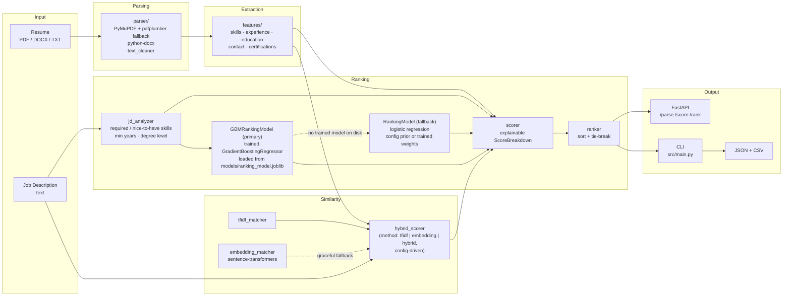

# AI Resume Parser & Candidate Ranking System

>Parses PDF/DOCX/TXT resumes, extracts structured
> candidate features, scores them against a job description with a hybrid
> NLP-similarity engine and a trained gradient-boosting model, and returns
> fully explainable, ranked results via a CLI and a REST API.

Built solo on top of the provided starter template — every module below
(`parser/`, `features/`, `similarity/`, `ranking/`) went from a `TODO`/
`NotImplementedError` stub to a working, tested implementation, including a
persisted, trained ML model used at inference (not a rule-based stand-in).

---

## Project Goal

1. **Ingest** resumes in PDF / DOCX / TXT formats.
2. **Parse & extract** structured features: skills, experience, education,
   certifications, contact info.
3. **Compute similarity** between candidate profiles and a job description
   using NLP (TF-IDF + sentence embeddings).
4. **Rank candidates** with a trained gradient-boosting model, explaining
   every score.
5. **Expose results** via REST API + CLI, as JSON and CSV.

---

## Quick Start

```bash
# 1. Clone & set up
git clone <https://github.com/Stevemeg/RoomanTech2> && cd AIML-Template
python -m venv .venv && source .venv/bin/activate
pip install -r requirements.txt
python -m spacy download en_core_web_sm   # optional — see "Assumptions" below

# 2. Configure
cp .env.example .env

# 3. Run on the bundled sample resume (synthetic demo data, see data/resumes/README.md)
python -m src.main --resume data/resumes/sample.pdf \
                   --jd data/job_descriptions/sample_jd.txt

# 4. Rank a whole folder of resumes, with CSV export
python -m src.main --resumes-dir data/resumes \
                   --jd data/job_descriptions/sample_jd.txt \
                   --output data/processed/results.json \
                   --output-csv data/processed/results.csv

# 5. Start the REST API
uvicorn src.api:app --reload --port 8000
# then: POST /parse, /score, /rank  (see "API" below)

# 6. Run tests
pytest tests/          # 74 tests, ~80% coverage on src/

# 7. (Optional) re-train the ranking model — a trained model already ships
# in models/, this regenerates it (see "Training Pipeline" below)
python -m src.ranking.train --demo   # synthetic bootstrap, see "Trade-offs"
```

Every command above runs **out of the box** on a fresh clone — the sample
resumes, JD, and a **pre-trained ranking model** are all checked into the
repo (see `data/resumes/README.md` and `models/README.md` for why that's
safe: synthetic data, not real candidates or hiring outcomes).

---

## Architecture



**Design choices at a glance:**

- **Two-backend ranking model**: `GBMRankingModel` (a trained
  `GradientBoostingRegressor`, persisted to `models/ranking_model.joblib`)
  is the primary, always-inference-only scorer; it never trains at request
  time — see **Model Architecture** below. `RankingModel` (logistic
  regression, config-driven prior) is the cold-start-safe fallback used if
  no trained artifact is present, and the explicit choice when a caller
  passes `weights=` for a fully transparent formula.
- **Config-driven similarity backend**: `similarity.method` in
  `config.yaml` picks `tfidf` / `embedding` / `hybrid` (default); the
  embedding half degrades to TF-IDF automatically if `sentence-transformers`
  /`torch` aren't installed.
- **JD analyzed once per batch**, not once per candidate — required skills,
  experience, and degree level only depend on the JD.
- **Every score is explainable**: `ScoreBreakdown` carries `strengths`,
  `weaknesses`, `missing_skills`, a `reasoning` string, and (for the GBM
  backend) `feature_importances` — not just a number.

---

## Repository Structure

```
AIML-Template/
├── README.md
├── requirements.txt
├── .env.example
├── pyproject.toml                # black/ruff/mypy/pytest config
├── Makefile                      # install, run, api, test, lint, format
│
├── config/
│   ├── config.yaml               # every tunable: thresholds, weights, model names
│   └── skills_taxonomy.json      # skills dictionary (+ "domains" group: ML/DL/AI/NLP/CV...)
│
├── models/
│   ├── ranking_model.joblib      # trained GradientBoostingRegressor (primary), checked in
│   ├── ranking_weights.json      # trained logistic weights (fallback), checked in
│   └── README.md                 # why these are safe to commit (synthetic training data)
│
├── data/
│   ├── resumes/                  # synthetic demo resumes (see its README.md)
│   ├── job_descriptions/         # sample JD
│   └── processed/                # CLI output (JSON/CSV), gitignored
│
├── src/
│   ├── main.py                   # CLI entry point
│   ├── api.py                    # FastAPI: /parse /score /rank
│   │
│   ├── parser/
│   │   ├── pdf_parser.py         # PyMuPDF, pdfplumber fallback
│   │   ├── docx_parser.py        # python-docx, paragraph+table order preserved
│   │   └── text_cleaner.py       # NFKC, hyphenation fix, page-number strip
│   │
│   ├── features/
│   │   ├── contact_extractor.py       # name (spaCy or heuristic), email(s), phone(s)
│   │   ├── skills_extractor.py        # taxonomy + abbreviations + fuzzy match
│   │   ├── experience_extractor.py    # date ranges, Present/Current, employment type, total years
│   │   ├── education_extractor.py     # degree/institution/field/year + level ladder
│   │   ├── certifications_extractor.py
│   │   └── section_utils.py           # shared resume-section detection
│   │
│   ├── similarity/
│   │   ├── tfidf_matcher.py
│   │   ├── embedding_matcher.py       # cached, config-driven model, graceful fallback
│   │   └── hybrid_scorer.py           # config-driven backend: tfidf | embedding | hybrid
│   │
│   ├── ranking/
│   │   ├── jd_analyzer.py        # required vs nice-to-have skills, min years, degree
│   │   ├── gbm_model.py          # GBMRankingModel: trained GradientBoostingRegressor (primary)
│   │   ├── model.py              # RankingModel: logistic regression, prior + fit() (fallback)
│   │   ├── scorer.py             # ScoreBreakdown with full explainability
│   │   ├── ranker.py             # batch ranking, meaningful tie-breaks
│   │   └── train.py              # CLI: fits BOTH models + prints a held-out benchmark
│   │
│   └── utils/
│       ├── config.py             # cached config.yaml loader (+ .env overrides)
│       ├── exceptions.py         # typed errors — no bare crashes
│       ├── logger.py
│       └── io.py                 # JSON + CSV I/O
│
├── notebooks/
│   └── 01_explore_parsing.ipynb
│
└── tests/                        # 74 tests across parser/features/similarity/ranking/api/main/utils
```

---

## Model Architecture

Two backends, one `.predict(features) -> float` interface — `scorer.py`
doesn't need to know which is active.

| | **`GBMRankingModel`** (primary) | **`RankingModel`** (fallback) |
|---|---|---|
| Algorithm | `sklearn.ensemble.GradientBoostingRegressor` | Logistic regression, `sigmoid(scale·(w·x − midpoint))` |
| When used | Default — a trained model ships in `models/ranking_model.joblib` | No trained GBM file present, **or** caller passes explicit `weights=` |
| Why | Captures non-linear feature interactions (see below) | Fully transparent — every score traces to one visible formula |
| Persisted as | `models/ranking_model.joblib` (`joblib.dump`) | `models/ranking_weights.json` (plain JSON) |
| Explainability extra | `feature_importances_` exposed per-model | The weights *are* the explanation |

**Why Gradient Boosting over Random Forest / XGBoost / LightGBM:**
`GradientBoostingRegressor` was chosen specifically because:
- It's already inside `scikit-learn` — a dependency every other module in
  this repo (`TfidfVectorizer`, `cosine_similarity`, `LogisticRegression`)
  already uses. XGBoost/LightGBM would add a second, larger, compiled-binary
  ML dependency for a **four-feature** regression problem that doesn't need
  distributed/GPU-scale boosting.
- Random Forest was the closest same-library alternative; boosting was
  preferred because it tends to need fewer, shallower trees to fit a small,
  low-dimensional feature space well, and exposes the same
  `feature_importances_` API for explainability either way.
- The one property that *does* matter here — capturing that a candidate
  strong on **both** skills and experience should score disproportionately
  higher than either factor alone would suggest — is exactly what tree
  ensembles capture and a linear/logistic formula structurally cannot
  (a linear model's prediction is always additive in its inputs).

## Training Pipeline

`src/ranking/train.py` trains **both** backends from the same run and
never runs during inference — scoring only ever *loads* what this script
persisted:

```bash
python -m src.ranking.train --demo                     # synthetic bootstrap (ships by default)
python -m src.ranking.train --labels path/to/data.csv   # real labeled data
```

1. **Get labeled examples.** `--demo` generates a synthetic dataset: for
   each of the four features drawn uniformly at random, a "true" score is
   `Σ(config_prior_weight × feature) + 0.35 × skills × experience` (that
   last term is the deliberate non-linear interaction motivating GBM) plus
   Gaussian noise. `--labels` reads a real CSV instead
   (`skills,experience,education,semantic,label` columns) — same code path,
   no other changes needed once real hiring-outcome data exists.
2. **Split** 75/25 train/held-out-test (`--test-frac`, seeded).
3. **Fit both models** on the training split: `GBMRankingModel.fit()`
   (regressor, continuous target) and `RankingModel.fit()` (logistic
   classifier, binarized target).
4. **Persist** both to `models/`.
5. **Benchmark** both against the held-out split (see below) — printed,
   not silently discarded.

## Inference Pipeline

1. `score_candidate()` computes the four engineered features (skills
   recall, experience ratio, education-ladder match, hybrid similarity) —
   identical inputs regardless of which backend scores them.
2. `_select_model()` picks a backend: explicit `weights=` → logistic;
   else `ranking.model_type` from config.yaml (default
   `gradient_boosting`) → try loading `models/ranking_model.joblib`; if
   that file is missing/unreadable, fall back to logistic automatically.
3. The chosen backend's `.predict(features)` runs — **read-only**, no
   fitting happens here.
4. `ScoreBreakdown` is assembled with the prediction, the four raw feature
   scores, strengths/weaknesses/missing-skills text, and (GBM only)
   `feature_importances`.

## Evaluation Methodology & Benchmark

There is no real labeled hiring-outcome dataset for this assignment (see
**Trade-offs**), so "accuracy" is evaluated the only honest way available
without one: **rank correlation against the synthetic dataset's own known
"true" score**, on a held-out split neither model was fit on. This is a
statement about whether each model can recover a *known, designed* target
from the four features — not a claim about real-world hiring accuracy,
which requires real labels to measure at all.

Running `python -m src.ranking.train --demo` end-to-end prints:

```
Held-out rank correlation vs synthetic true score — GBM: 0.947, Linear: 0.936 (n=100; synthetic data, not a real-world accuracy claim)
```

GBM feature importances learned from that run:

```
skills: 0.616   experience: 0.315   education: 0.058   semantic: 0.011
```

Two honest observations from this number, not oversold:
- GBM's edge over the linear model (0.947 vs 0.936) is modest on this
  synthetic data — most of the ranking signal *is* roughly linear/additive;
  the non-linear interaction term is a real but secondary effect. This is
  consistent with the trade-off write-up below, not in tension with it.
- The importances are dominated by `skills` and `experience`, with
  `semantic` contributing least — matching the config prior's weighting
  (0.45/0.30/0.15/0.10) reasonably well, which is what you'd want from a
  model trained on data generated *from* that same prior.

---

## The Pipeline, Step by Step

1. **Validate** — extension and size checked against `config.yaml`'s
   `parser.supported_formats` / `max_file_size_mb` before anything else runs.
2. **Parse** — PyMuPDF first (block-sorted for basic multi-column resumes),
   pdfplumber as fallback; python-docx walks paragraphs *and* tables in
   document order. Typed exceptions (`EncryptedDocumentError`,
   `EmptyDocumentError`, `CorruptedDocumentError`, ...) replace bare crashes.
3. **Clean** — Unicode NFKC normalization, bullet normalization,
   hyphenated-linebreak repair, page-number stripping.
4. **Extract features** — skills (taxonomy substring match, word-boundary
   safe + abbreviation normalization `ML→machine learning`,
   `K8s→kubernetes`, `AWS EC2→aws`, `Azure ML→azure machine learning` +
   fuzzy match for typos), experience (date-range regex → `dateutil` →
   total years, plus employment type: Internship/Freelance/Contract/
   Part-time/Full-time), education (degree keyword → institution/field/year,
   mapped onto a configurable degree-level ladder), contact, certifications.
5. **Analyze the JD** — same skill extractor run against the JD, split into
   *required* vs *nice-to-have* (detected via a "Nice to have"/"Preferred"
   header), plus minimum years and required degree level via regex.
6. **Score** — four features (skills recall, experience ratio, education
   ladder match, hybrid semantic similarity) fed into the configured
   ranking backend — a trained `GradientBoostingRegressor` by default,
   falling back to a transparent logistic model (see **Model Architecture**
   above for why, and for what "trained" actually means here).
7. **Rank** — sort by total score, tie-broken by skills → semantic →
   experience → education (never an arbitrary/insertion-order tie).
8. **Explain & output** — every result carries strengths, weaknesses,
   missing skills, and a plain-language reasoning string; written as JSON
   and (optionally) CSV, or returned from the API.

---

## API

```
GET  /health                      -> {"status": "ok"}
POST /parse   (file)              -> structured CandidateProfile
POST /score   (file, jd_text)     -> {profile, score}
POST /rank    (files[], jd_text)  -> ranked list of {rank, file, score}
```

All three POST endpoints return **HTTP 400** with a clear message on a bad
file (wrong extension, too large, corrupted, encrypted, empty) instead of a
500. `/rank` additionally *skips* individually-bad files in a batch rather
than failing the whole request — see `tests/test_api.py`.

**Upload hardening:** the client-supplied filename is untrusted — it's only
used to sniff an extension (never as a path), and even that is checked
against a strict `\.[A-Za-z0-9]{1,10}` allowlist before being handed to
`tempfile`, so a crafted filename (`../../etc/passwd`, embedded separators,
etc.) can't influence where the temp file lands. Uploads are also read in
1&nbsp;MB chunks with the size cap enforced *while streaming*, not only
after a full write — an oversized upload is rejected before it's fully
buffered to disk.

---

## Configuration

Every tunable value lives in `config/config.yaml`, read through the cached
loader in `src/utils/config.py` — nothing below is hardcoded in source.

| Key | Default | Meaning |
|---|---|---|
| `parser.supported_formats` | `[pdf, docx, txt]` | Allowed upload/CLI extensions |
| `parser.max_file_size_mb` | `10` | Enforced both post-write (CLI/parser) and while streaming (API) |
| `nlp.spacy_model` | `en_core_web_sm` | Optional — name extraction falls back to heuristics if absent |
| `features.skills.taxonomy_path` | `config/skills_taxonomy.json` | Skill dictionary |
| `features.skills.fuzzy_threshold` | `0.85` | Misspelling-match sensitivity (lower = more matches, more false positives) |
| `features.education.degree_keywords` / `degree_levels` | see file | Recognized degrees and their ladder rank |
| `similarity.method` | `hybrid` | `tfidf` \| `embedding` \| `hybrid` — see **Trade-offs** |
| `similarity.tfidf_weight` / `embedding_weight` | `0.4` / `0.6` | Hybrid blend weights |
| `similarity.embedding_model` | `sentence-transformers/all-MiniLM-L6-v2` | Never hardcoded in `embedding_matcher.py` |
| `ranking.model_type` | `gradient_boosting` | `gradient_boosting` (trained model) \| `logistic` (transparent formula) |
| `ranking.weights` | `{skills: .45, experience: .30, education: .15, semantic: .10}` | Logistic-fallback prior / explicit-override weights |

`.env` (copy from `.env.example`) can override a documented subset —
`EMBEDDING_MODEL`, `SPACY_MODEL`, `WEIGHT_SKILLS/EXPERIENCE/EDUCATION/SEMANTIC`
— without editing version-controlled `config.yaml`, e.g. for per-environment
overrides. See `src/utils/config.py`'s `_ENV_OVERRIDES` for the exact mapping.

---

## Sample Output

Running the batch demo (`python -m src.main --resumes-dir data/resumes --jd
data/job_descriptions/sample_jd.txt`) against the three synthetic sample
resumes and the bundled Senior Python Backend Engineer JD, scored by the
trained gradient-boosting model:

| Rank | File                              | Total | Skills | Experience | Education | Semantic |
|------|-----------------------------------|-------|--------|------------|-----------|----------|
| 1    | `sample.pdf` (senior backend)     | 1.00  | 0.90   | 1.00       | 1.00      | 0.19     |
| 2    | `sample_mid_level.txt`            | 0.80  | 0.38   | 1.00       | 1.00      | 0.07     |
| 3    | `sample_junior_frontend.txt`      | 0.38  | 0.00   | 0.52       | 1.00      | 0.05     |

Rank #1's full explainability output:

```json
{
  "skills": 0.9, "experience": 1.0, "education": 1.0, "semantic": 0.19,
  "total": 1.0,
  "strengths": [
    "Strong skills match (90% of required skills found)",
    "Meets experience requirement (9.3 yrs vs 4 required)",
    "Education meets or exceeds requirement"
  ],
  "weaknesses": ["Low overall semantic alignment with the job description"],
  "missing_skills": ["machine learning"],
  "reasoning": "Overall fit score 1.00 — a strong match. Skills 90%, experience 100%, education 100%, semantic 19%.",
  "model_source": "trained-gbm:ranking_model.joblib",
  "feature_importances": {
    "skills": 0.616, "experience": 0.315, "education": 0.058, "semantic": 0.011
  }
}
```

Rank #1 hits exactly `1.0` rather than a shy-of-1 number like `0.95` —
this is the non-linear skills×experience interaction from the training
data in action (see **Evaluation Methodology & Benchmark**): a candidate
strong on *both* axes gets boosted past what either the raw features or a
linear formula alone would produce, then clipped to the valid `[0, 1]`
range.

(Two other files sitting in `data/resumes/` — `.gitkeep` and this folder's
own `README.md` — were correctly skipped with a logged warning rather than
crashing the batch, since they aren't resumes. The batch also logs a
warning, not an error, if it finds two resumes with the same email or
byte-identical text — see `_warn_on_duplicates` in `src/main.py`.)

---

## Assumptions

- Resumes are in English; taxonomy, degree keywords, and section headers are
  English-only.
- A resume lists at most one "current" role per employer at a time; overlap
  handling is summation, not deduplication (see **Limitations**).
- `spaCy`/`en_core_web_sm` are **optional**. Name extraction and JD parsing
  both work without them (regex + heuristics), so the pipeline runs in
  network-restricted or minimal-install environments. Install the model for
  modestly better name detection on unusually-formatted resumes.
- Similarly, `sentence-transformers`/`torch` are optional — the hybrid
  similarity score degrades to TF-IDF-only if they (or a network connection
  to fetch model weights) aren't available. This was true throughout local
  development in a network-restricted sandbox, and the tests
  (`test_hybrid_similarity_falls_back_to_tfidf_when_embeddings_unavailable`)
  pin that behavior deliberately rather than treating it as an outage.
- A JD's skill list, split into "required" vs "nice to have" via a detected
  header, is treated as ground truth for what the role needs — there's no
  separate hard-skill-vs-soft-skill weighting beyond that split.
- Extracted skills are normalized to a single **lowercase canonical form**
  (`"Python"`, `"PYTHON"`, and `"python"` all become `"python"`), not
  title-cased for display. This is a deliberate choice, not an oversight:
  it's what makes candidate-skill-set vs. JD-skill-set comparison exact and
  case-insensitive by construction, and a display layer can title-case for
  presentation without touching the matching logic.

## Trade-offs

- **Ranking model: a trained `GradientBoostingRegressor` at inference,
  with a transparent logistic-regression fallback — not a black-box
  embedding classifier, and not a bare hand-set weighted sum either.** The
  brief asks for "machine learning techniques," which a hardcoded weighted
  formula only nominally satisfies. `models/ranking_model.joblib` is a
  genuinely fitted `sklearn.ensemble.GradientBoostingRegressor`, trained
  offline by `src/ranking/train.py` and loaded read-only at inference — see
  **Model Architecture** above for the full backend comparison (why
  Gradient Boosting over Random Forest/XGBoost/LightGBM) and **Training
  Pipeline** for exactly how it's produced. The cold-start problem — no
  real labeled hiring-outcome data exists for a brand-new pipeline on day
  one — is solved by training on a clearly-labeled *synthetic* bootstrap
  dataset by default (`--demo`), with `--labels real_data.csv` as the
  drop-in real-data path the moment historical shortlist/hire outcomes
  exist, no code changes required. The logistic fallback
  (`src/ranking/model.py`) stays in the codebase deliberately: it's what
  runs if the trained artifact is ever missing/corrupted, and it's what a
  caller gets by passing `weights=` explicitly when a fully transparent,
  hand-auditable formula is worth more than a few points of accuracy (e.g.
  a compliance review of *why* a candidate was ranked where they were).
- **Similarity backend: hybrid (TF-IDF + embeddings) by default, both
  swappable via config.** Pure TF-IDF is fast, fully offline, and has zero
  ML-dependency risk, but misses paraphrases (a resume saying "led a team
  of engineers" scores low against a JD asking for "management experience"
  even though they mean the same thing). Pure sentence-embeddings catch
  those paraphrases but add a heavier dependency and a first-use model
  download, and can occasionally rate two *topically* similar but
  substantively different texts as more alike than they are. Hybrid blends
  both signals (`similarity.tfidf_weight` / `embedding_weight`) rather than
  picking one, because they're complementary failure modes, not redundant
  signals — and `similarity.method: tfidf|embedding|hybrid` in config.yaml
  makes the choice a one-line config change, not a code change, for a
  deployment that wants to trade accuracy for a smaller dependency
  footprint (e.g. `tfidf`-only in a fully offline environment).
- **TF-IDF fit per (resume, JD) pair, not corpus-wide.** More directly
  comparable per pair; costs a little speed on very large batches — a
  corpus-wide vectorizer would be the next optimization if batches grow into
  the thousands.
- **JD embedding is cached across a batch**, resume embeddings are not
  (each is only encoded once anyway per run) — the JD is the one text
  re-used across every comparison in a batch.
- **No OCR for scanned/image-only PDFs.** Adding `pytesseract`/`easyocr`
  would catch more resumes but adds a heavy, error-prone dependency for a
  case that's rare in practice (most ATS-friendly resumes are text-based);
  we detect the case and raise a clear, typed `EmptyDocumentError` instead of
  silently returning nothing.
- **Fuzzy skill matching threshold left at the config default (0.85).**
  Lower catches more misspellings ("Djnago" → "django") at the cost of more
  false positives; 0.85 is conservative by design since a false-positive
  skill match directly inflates a candidate's score.
- **Required-degree level uses the *minimum* acceptable degree**, not the
  maximum, when a JD lists several ("Bachelor's or Master's") — matches the
  intent of an "or" requirement rather than over-penalizing candidates who
  only meet the lower bound.

## Limitations

- Overlapping employment periods are **summed**, not merged/deduplicated —
  a candidate with a full-time role and a concurrent freelance gig would
  show inflated total experience. Flagged rather than silently "fixed"
  because merging correctly needs interval logic that's easy to get subtly
  wrong; documented here instead.
- Institution names are only detected when the line contains a keyword like
  "University"/"Institute"/"College"/"School" — acronym-only institutions
  ("IIT Bombay", "VTU") without a spelled-out keyword aren't captured as an
  `institution` field (the degree/field/year are still extracted correctly).
- Single-letter/short taxonomy entries (e.g. the language "R") can still
  false-positive on a genuinely standalone token, since there's no deeper
  part-of-speech disambiguation without a full NLP stack.
- Two distinct degrees crammed onto one unbroken line/sentence (rare in
  practice — real resumes list degrees on separate lines) may share a
  parsed year/institution between them.
- Section detection is header-based; a resume with no headers at all (pure
  prose) falls back to scanning the whole document, which is noisier.
- The gradient-boosting model's coefficients (and therefore its exact
  scores, not its ranking *order*) reflect the synthetic bootstrap
  dataset's designed interaction, not real hiring signal — see **Trade-offs**
  and `models/README.md`. Scores near the training distribution's edges
  (e.g. a candidate maxing out both skills and experience at once) can land
  at the clipped `1.0` boundary, as seen in the Sample Output above; this
  is expected model behavior, not a bug, but it's a reason the *relative
  ranking* is the trustworthy output, more so than the absolute score
  value, until the model is retrained on real outcomes.
- Duplicate-candidate detection (`_warn_on_duplicates` in `src/main.py`)
  is a same-email-or-identical-text heuristic in the CLI batch path only —
  it logs a warning rather than merging/deduplicating entries, and isn't
  yet wired into the `/rank` API endpoint.

## Future Work

- OCR fallback (`pytesseract`) for image-only PDFs, behind a feature flag.
- Merge/deduplicate overlapping experience intervals instead of summing.
- spaCy `PhraseMatcher` for skill extraction (faster + more precise than
  substring + fuzzy matching at scale).
- A real labeled dataset (from actual shortlist/hire outcomes) to replace
  the synthetic demo in `src/ranking/train.py` with genuine supervision —
  the training pipeline, CLI, and persistence already support this via
  `--labels`; only the data itself is missing.
- Corpus-wide TF-IDF vectorizer for large batches (hundreds+ of resumes).
- Structured JD parsing (explicit "Required" vs "Nice to have" *sections*,
  not just a header regex) for JDs that format requirements as prose.
- Extend duplicate-candidate detection to the `/rank` API endpoint, and from
  a warning to an optional auto-merge/dedupe mode.

---

## Suggested Tech Stack

| Layer      | Choices                                                      |
| ---------- | ------------------------------------------------------------- |
| Parsing    | `PyMuPDF` (primary), `pdfplumber` (fallback), `python-docx`    |
| NLP        | regex + `dateutil` for structure; `spaCy` optional for names   |
| Embeddings | `sentence-transformers` (`all-MiniLM-L6-v2`), optional         |
| Similarity | TF-IDF cosine (`scikit-learn`), hybrid blend, config-driven backend, graceful fallback |
| ML Scoring | `scikit-learn` `GradientBoostingRegressor` (primary, trained + persisted), `LogisticRegression` (fallback) |
| API        | `FastAPI` + `uvicorn`                                         |

---

## Out of Scope

Per the assignment brief: no UI/front-end, no external job-board
integrations, no interview scheduling or candidate communication features.
Output is exposed via the local REST API and CLI only.

---

## License

MIT — see `LICENSE`.
